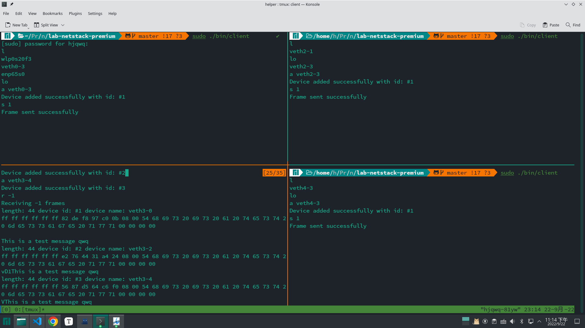
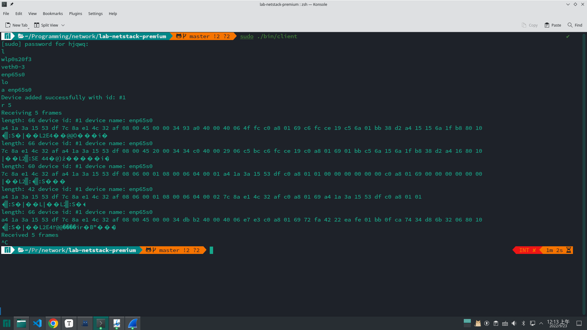

# Lab 1 report

## 胡晋侨 2000013141

### WT 1

1. 827
2. The destination address is `ff:ff:ff:ff:ff:ff`, it is a broadcast address, i.e. all devices can receive this frame.
3. `0x15`

### PT 1

see `./src/device.h` and `./src/device.c`. To get the list of network devices and their hardware address, I read from `/sys/class/net/xxx/address`(cause I don't know how to get the hardware address with `libpcap`!)

### PT 2

see `./src/packetio.h` and `./src/packetio.c`. Here I used I/O multiplexing to support receiving packets from multiple devices simultaneously.

### CP 1 & CP 2

(Note: the code is written and tested in linux, and doesn't guaruntee to work on other UNIX-like operating systems, e.g. FreeBSD and MacOS, since network devices might behave differently according to the `libpcap` manual.)

To demonstrate my implementation, I wrote `./src/client.c`. Type `make` in the terminal to compile the whole thing, then type `sudo ./bin/client` to interact with the client program. The client supports 4 commands:

- `l`: list all available network devices
- `a <name>`: add a device by `name`
- `s <id>`: send a frame to device `id`
- `r <cnt>`: receive `cnt` frames. If `cnt<=0`, then receive frames indefinitely

Here, the message in the frame is predefined in `./src/client.c`, and the destination address is `ff:ff:ff:ff:ff:ff`(broadcast). The callback funtion prints the length of the frame, the device that received the frame, and the first 48 bytes of the frame. 

For the experiment, I used the topology provided in the example of `vnetUtils` (see `./vnetUtils/readme.md`). Hosts `ns0,ns2,ns4` sends frames to `ns3`. Here's the commands I used:

```
# ns0
l
a veth0-3
s 1

# ns2
l
a veth2-3
s 1

# ns3
l
a veth3-0
a veth3-2
a veth3-4
r -1

# ns4
l
a veth4-3
s 1

```

and here's the result:



And we may also use this client to capture frames from real network devices:

