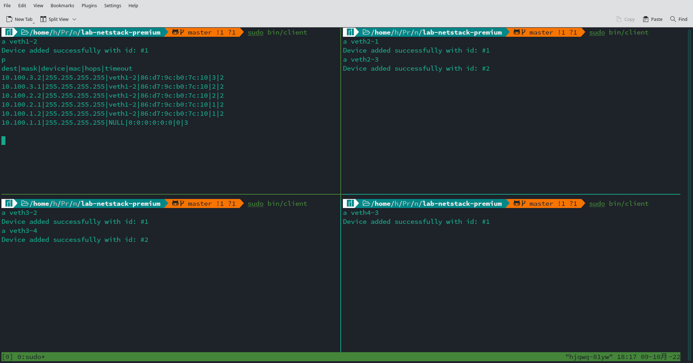
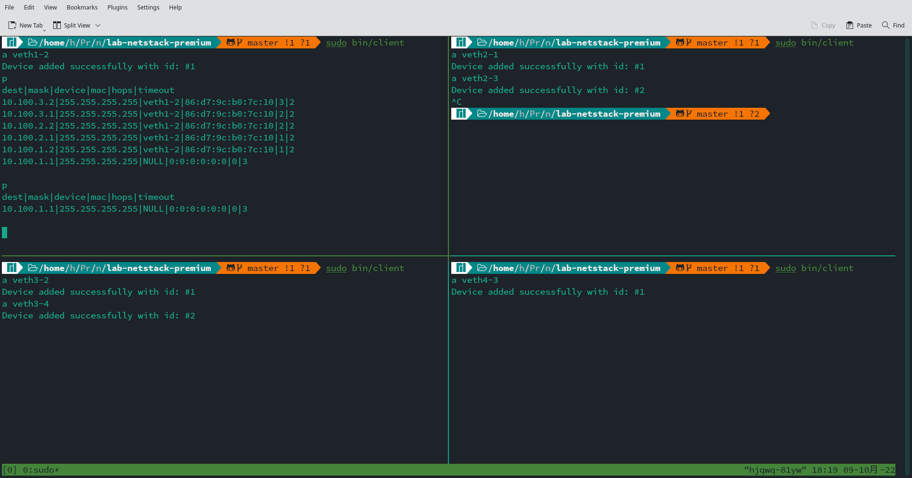
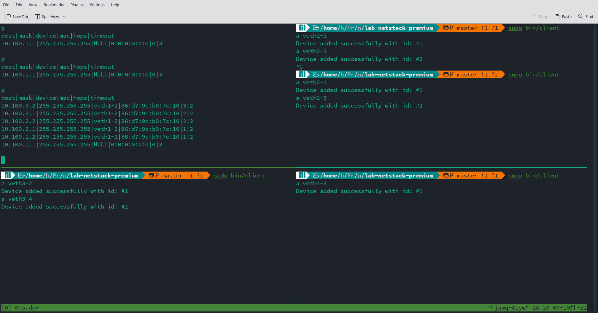
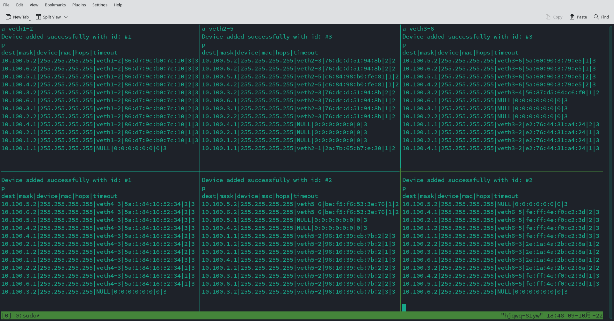
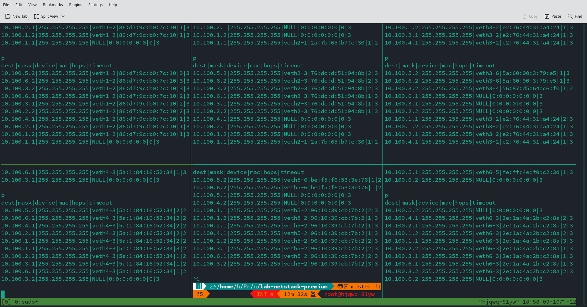
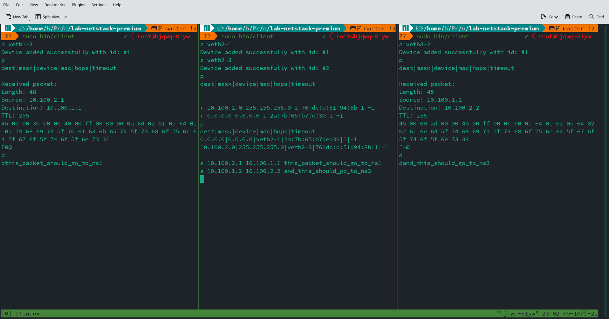

# Lab 2 report

## 胡晋侨 2000013141

### WT 2

1. The target MAC address of the ARP reply is the same as the source MAC address of the ARP request.
2. 6
3. Length of IPv4 headers is 20 bytes, while length of IPv6 headers is 40 bytes.

### PT 3

(Note: the code is written and tested in linux, and doesn't guaruntee to work on other UNIX-like operating systems, e.g. FreeBSD and MacOS, since network devices might behave differently according to the `libpcap` manual.)

The declarations are in `src/ip.h`, while the implementation is in `src/ip.c`. The program for demonstration is located in `src/client.c`, where 3 threads run concurrently: one runs in the foreground and interacts with the user, one runs in the background, receive packets and process them, and one runs in the background, wakes up every second to broadcast the routing table, and clean up expired routing entries. The source files written in lab 1 are also modified a bit for compatibility.

After compiling with `make`, one can run the compiled executable with `sudo bin/client`. The program support 6 commands:

+ `l`: list all available network devices
+ `a <name>`: add a device by `name`
+ `d`: show the list of added devices
+ `p`: print the routing table
+ `s <src_ip> <dest_ip> <msg>`: send an IP packet from `src_ip` to `dest_ip`, where the payload is `msg`
+ `r <dest_ip> <mask> <id> <mac> <hops> <timeout>`: add a routing entry with the listed parameters

### WT 3

Each entry of the routing table contains the MAC address of the next hop, so one can simply look up the routing table to find out the MAC address to send the packet to. To maintain the routing table, each host broadcasts its routing table to its neighbors every second. On receiving the routing table, a host can update its own routing table, while using the source MAC address as the next hop MAC address.

### WT 4

My implementation uses the distance vector routing algorithm. Each routing entry has an attribute "timeout", which describes the time left for this entry to expire. Here the timeout is set to 3 seconds. A background thread maintains the routing table here: each second, it broadcasts the routing table to its neighbors, and subtract 1 from the timeout of all entries. When the timeout of an entry becomes 0, it is removed from the routing table.

Another background thread handles the received frames. It first drops all loop-back packets. Then it checks the type of the payload. If the payload is an IP packet targeted for this host, it calls the callback to process the packet. If the payload is an IP packet targeted for other hosts, then it looks up the routing table, and forward the packet to the next host. If the payload is a packet containing the routing table of a neighbor, it then updates the routing table using the packet.

### CP 3

```
0000   56 87 d5 64 c6 f0 5a 01 84 16 52 34 08 00 45 00   V..d..Z...R4..E.
0010   00 1b 00 00 40 00 fd 00 00 00 0a 64 01 01 0a 64   ....@......d...d
0020   03 02 51 77 51 77 51 77 51 00 00 00 00            ..QwQwQwQ....
```

(We start from the Ethernet frame here)
Bytes `0x0-0x5` contains the destination MAC address.
Bytes `0x6-0xB` contains the source MAC address.
Bytes `0xC-0xD` is `0x0800`, which means that the Ethernet payload is an IP packet.
Byte at `0xE`  is `0x45`, which means the IP version is 4, and IP header length is 20 bytes.
Byte `0xF` means Type of Service, and is ignored here.
Bytes `0x10-0x11` specifies the length of the packet, which is `0x001b`.
Bytes `0x12-0x13` is the Identification field, and is ignored here since we don't do fragmentation.
Bytes `0x14-0x15` is the field about fragmentation, and only the "Don't Fragment" bit is set.
Byte `0x16` is TTL, which is `0xfd`, means the packet can go through at most `0xfd` hops.
Byte `0x17` is the protocol field, which is `0x0` here.
Bytes `0x18-0x19` is the header checksum. Here it is ignored, and set to `0x0`.
Bytes `0x1A-0x1D` is the source IP address, which is `10.100.1.1` here.
Bytes `0x1E-0x21` is the destination IP address, which is `10.100.3.2` here.
Bytes `0x22-0x28` is the IP payload. Here it's "QwQwQwQ" in ASCII.
Bytes `0x29-0x2C` is the Ethernet checksum, and is ignored here.

### CP 4

The configuration for the virtual network is in `./vnetUtils/examples/test1.txt`. I also disabled the kernel protocol stack for the network namespaces.



After connecting the four hosts, we print the routing table of `ns1`. It can be seen that `10.100.3.2`, which is the IP address of the device on `ns4`, is within 3 hops of `ns1`.



Here, after disconnecting the client on `ns2`, the routing table of `ns1` only contains itself, since other entries have all expired.



Now we restart the client on `ns2`, and the routing entries for `ns2,ns3,ns4` is back on `ns1`.

### CP 5

The configuration for the virtual network is in `./vnetUtils/examples/test2.txt`. I also disabled the kernel protocol stack for the network namespaces.



Here is the routing table for each of the hosts. (Here the hosts are displayed as `1 2 3 \n 4 5 6`). If we translate it into hops between hosts, we get:

|      | ns1  | ns2  | ns3  | ns4  | ns5  | ns6  |
| :--: | :--: | :--: | :--: | :--: | :--: | :--: |
| ns1  |  0   |  1   |  2   |  3   |  2   |  3   |
| ns2  |  1   |  0   |  1   |  2   |  1   |  2   |
| ns3  |  2   |  1   |  0   |  1   |  2   |  1   |
| ns4  |  3   |  2   |  1   |  0   |  3   |  2   |
| ns5  |  2   |  1   |  2   |  3   |  0   |  1   |
| ns6  |  3   |  2   |  1   |  2   |  1   |  0   |



And after we disconnect `ns5` from the network, we get the routing table as above. If we translate it into hops between hosts, we get:

|      | ns1  | ns2  | ns3  | ns4  | ns5  | ns6  |
| :--: | :--: | :--: | :--: | :--: | :--: | :--: |
| ns1  |  0   |  1   |  2   |  3   |  -   |  3   |
| ns2  |  1   |  0   |  1   |  2   |  -   |  2   |
| ns3  |  2   |  1   |  0   |  1   |  -   |  1   |
| ns4  |  3   |  2   |  1   |  0   |  -   |  2   |
| ns5  |  -   |  -   |  -   |  -   |  -   |  -   |
| ns6  |  3   |  2   |  1   |  2   |  -   |  0   |

As we can see, disconnnecting `ns5` from the network has no significant effect on other hosts.

### CP 6

To show that the "longest prefix matching" rule applies in my implementation, I created a small network in `./vnetUtils/examples/test3.txt`, and disabled automatic routing table update (by commenting all the stuff in timer_thread). Now we only add routing entries manually.



The first routing entry for `ns2` routes all traffic to `ns1`, while the second routes `10.100.2.0/24` to `ns3`. Then we send packets to `10.100.1.1` and `10.100.2.2` respectively. We can see that both packets go to the correct host.