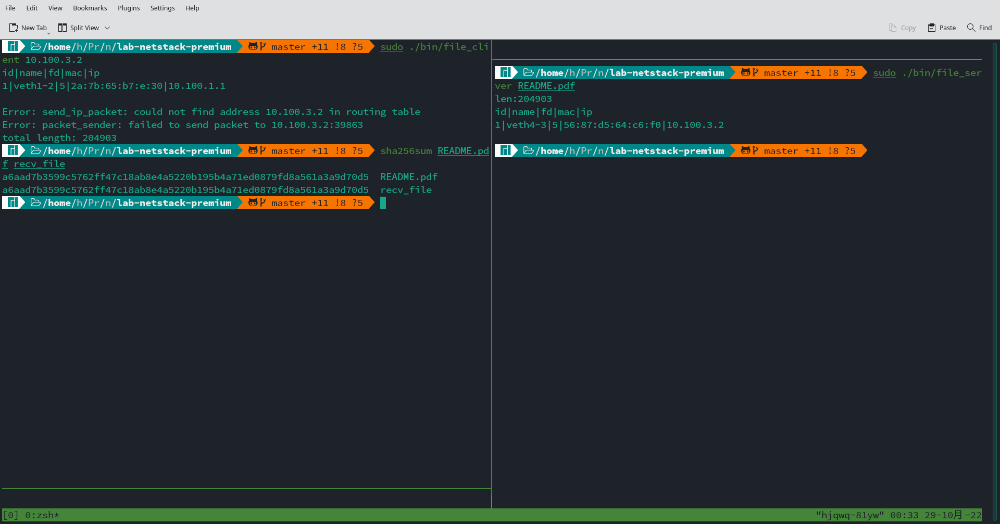
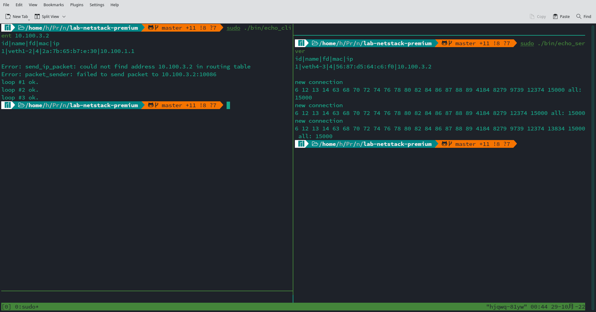
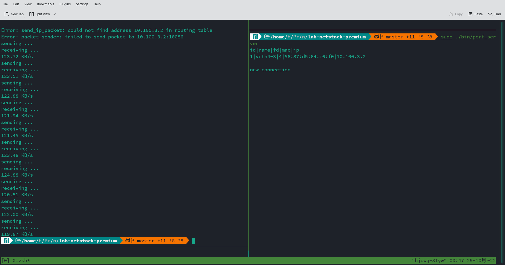

# Lab 3 report

## 胡晋侨 2000013141

### WT 5

1. There are two sessions in total. The first session contains 12 packets, and the second session contains 1652 packets.
2. + 10.0.0.74, 43120, 115.27.207.221, 80
   + 10.0.0.74, 43122, 115.27.207.221, 80
3. The accept window size is 43520. This is specified by the window size segment 85, multiplied by the window size scaling factor 512 negotiated in the options segment of the SYN/ACK packet.

### PT 4

Each socket is specified by a `socket_s` struct, which stores the file descriptor, source and destination address, sequence and acknowledgement numbers, receive buffer, etc. A background thread is in charge of handling received packets. The received packets are handled by four functions: `syn_handler`, `syn_ack_handler`, `ack_handler` and `fin_handler`, according to the flags of the packet. The packet handlers store the received packets in the buffer, change the state of the sockets according to the TCP state machine, and send back an ACK packet for each packet with non-zero length. When a listening socket receives a SYN packet, it creates a new socket, and store the number of it in a buffer. When the server calls `connect`, we fetch a socket from the buffer.

To send each packet, a new thread is created, and checks the ACK number stored in the socket struct to decide whether to resend the packet every second. We use mutex locks to protect the socket structs and other global data. To save CPU utilization, we also use semaphores to block the read/write calls, until we can read/write the buffer. When the peer socket is closed, and the buffer is empty, a `read` attempt will return `0`  without blocking, which marks `EOF`. A `write` attempt also returns `0` when the peer socket is closed.

### CP 7

```
0000   56 87 d5 64 c6 f0 5a 01 84 16 52 34 08 00 45 00   V..d..Z...R4..E.
0010   00 2e 00 00 40 00 fd 06 64 ff 0a 64 01 01 0a 64   ....@...d..d...d
0020   03 02 04 00 27 66 6b 8b 45 68 6b 8b 45 68 50 10   ....'fk.Ehk.EhP.
0030   ff ff c5 da 00 00 68 65 6c 6c 6f 0a               ......hello.

```

The first 14 bytes is the Ethernet header, and the next 20 bytes are the IPv4 header. Starting from byte No. `0x22` is the TCP packet. `0x0400=1024` is the source port number, `0x2766=10086` is the destination port number. `0x6b8b4568=1804289384` is the sequence number, and `0x6b8b4568=1804289384` is the acknowledgement number. `0x50` means that the header length is `20`, and `0x10` is the flag byte, where only `ACK` is set. `0xffff=65535` is the window size. `0xc5da` is the TCP checksum. `0x0000` is the urgent pointer, which is not set here. The last 6 bytes is the TCP payload, which spells `hello ` in ASCII.

### CP 8

I used the network topology as specified in `test1.txt`: `ns1-ns2-ns3-ns4`, and set the loss rate between `ns2` and `ns3` to `50%`. To show that my implementation provides reliable delivery, I wrote a simple server to transfer a file to a connected client (see `./checkpoints/file_server.c` and `./checkpoints/file_client.c`, which compile to `./bin/file_server` and `./bin/file_client`) The client store the received file in `recv_file`. Then I can check the integrity of the received file using `sha256sum`. The results can be reproduced using the following commands:

- `./bin/file_server <filename>` The server load the file, and wait for a connection.
- `./bin/file_client <serverIP>` Connect to the server, and download the file, which is stored in `recv_file`.
- `./bin/client` It act as a router, and is required to run on all `hosts` between TCP endpoints. Enter `t` to add all available devices automatically.



Here the "Error" occur since the route table of `ns1` is not initialized until `ns2` sends it a message. This is not a big deal.
See `./checkpoints/packet_loss_test.pcapng` for the packet trace.

### CP 9



Here the "Error" occur since the route table of `ns1` is not initialized until `ns2` sends it a message. This is not a big deal.

### CP 10



(The server didn't close since you forgot to call `close(sockfd)` in `perf_client.c` qwq!)

Here the "Error" occur since the route table of `ns1` is not initialized until `ns2` sends it a message. This is not a big deal.
The data rate averages at `120KB/s`. However, if I try to increase the send/receive buffer size to `1MB`, then the data rate can go up to `2MB/s`. But this requires setting the `window scale` option, and might cause congestion, (and I'm lazy), so I didn't implement it.

